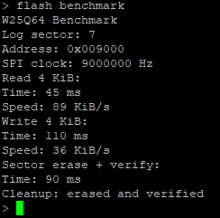
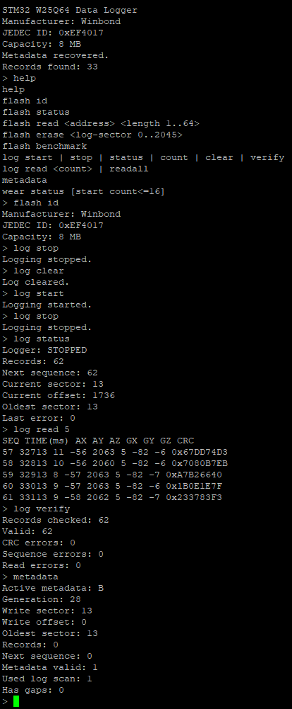
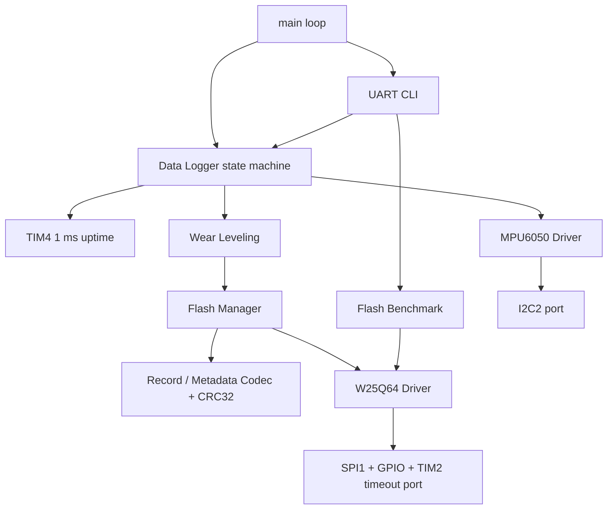
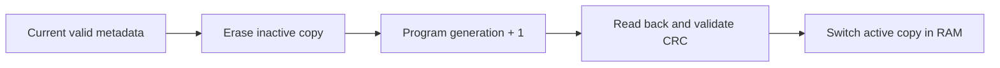

# STM32 W25Q64 Reliable Data Logger

在 STM32F103C8 上實作的 **power-loss-tolerant sensor data logger**。系統以 10 Hz 讀取 MPU6050 六軸資料，寫入 W25Q64 SPI NOR Flash，並透過 circular buffer、round-robin wear leveling、A/B metadata、CRC 與 boot recovery，在完全斷電後恢復紀錄及寫入位置。

| 項目 | 實作 |
| --- | --- |
| MCU | STM32F103C8，72 MHz，STM32F10x SPL V3.5.0 |
| Storage | Winbond W25Q64BV，8 MiB，SPI1 runtime-calculated SCK 9 MHz |
| Sensor | MPU6050，I2C2，10 Hz sampling |
| Interface | USART1 CLI，115200 8-N-1 |
| Release | v1.0.0（2026-09-13） |
| License | MIT（project-specific code）；vendor code 保留原始 notices |
| Capacity | 298,716 records，約 8.3 小時 @ 10 Hz |
| 狀態 | Phase 1–8、五個 reset-injection points、正式版斷電 Demo 全部通過 |

[架構](#系統架構) · [可靠性設計](#可靠性設計) · [實測結果](#實測結果) · [快速操作](#快速操作) · [完整驗收文件](docs/DETAILED_VALIDATION.md)

## 專案成果

- 從 SPI command layer 實作 W25Q64 driver，處理 WREN、BUSY timeout、page boundary、range/alignment check、read-back verify 與錯誤傳播。
- 使用固定 28-byte binary record 與 CRC-32，避免直接儲存 C struct 所造成的 padding、alignment 與 endian 相依性。
- 以 2046 個 4 KiB sectors 建立 bounded circular log，容量用盡時淘汰最舊 sector。
- 以 A/B metadata、generation 與 CRC 提供原子狀態切換；開機可 replay 尚未 checkpoint 的完整 records。
- 以 round-robin allocator 分散 sector erase；只有 erase/verify 成功才更新 wear counter 與 cursor。
- 提供無 malloc、固定 buffer 的 UART CLI，支援 log control、dump、CRC verify、wear diagnostics 與 Flash benchmark。
- 使用 host-side NOR model、ARMCC target build、debug reset injection 與真正斷電測試驗證錯誤路徑。
- 公開版本只保留本 target 使用的 SPL modules 與 medium-density startup，降低 vendor code 噪音。

## 實測結果

### W25Q64 Benchmark

測試條件：SPI1、runtime-calculated SCK 9 MHz、4 KiB sequential operation；program 與 erase 數字包含 WREN、BUSY polling 和 read-back verify。

| Operation | Time | Throughput |
| --- | ---: | ---: |
| Read 4 KiB | 45 ms | 89 KiB/s |
| Program 4 KiB（16 pages） | 110 ms | 36 KiB/s |
| Sector erase + verify | 90 ms | — |



### Power-loss Recovery

正式 image 在沒有 debugger mailbox、沒有重新 Download 的情況下完成端到端斷電測試：

| 驗收點 | 結果 |
| --- | --- |
| 斷電前 | 62 records，next sequence 62，最後 sequence 61 |
| 完全斷電 | MCU 與 W25Q64 斷電至少 5 秒 |
| 重新上電 | 恢復相同 62 records、next sequence 62、最後 sequence 61 |
| 繼續 logging | 第一筆新 record 從 sequence 62 延續 |
| 完整掃描 | CRC errors 0、sequence errors 0、read errors 0 |



另外在五個 durability boundaries 執行 debug-only reset injection：

1. Record 已 program/verify，RAM cursor 尚未更新。
2. Inactive metadata sector 已 erase，尚未 program。
3. Metadata 只寫入 18/36 bytes。
4. Metadata 已完整 program，RAM active copy 尚未切換。
5. Log sector 已 erase/verify，wear state 尚未更新。

五個位置重新開機後都恢復到一致狀態。完整操作與預期值見 [Detailed Implementation and Validation](docs/DETAILED_VALIDATION.md#debug-only-reset-injection)。

### Build 與測試

| 驗證 | 結果 |
| --- | --- |
| GCC host model | Phase 1–8 全數通過，`-Wall -Wextra -Werror -Wconversion -Wshadow -pedantic` |
| ARMCC 5.06 target | 0 errors、0 warnings |
| Final clean regression（2026-09-13） | 刪除 Objects/Listings/build 後重新產生 host tests、正式 image 與 test-enabled fixture，全部通過 |
| 正式 image | Code 22,104、RO 528、RW 232、ZI 18,200 bytes |
| RAM | 18,432 / 20,480 bytes，剩餘 2,048 bytes |
| Test-enabled fixture | Code 26,008、RO 544、RW 344、ZI 18,232 bytes；compile only |
| 實體硬體 | JEDEC、read/write/erase、跨頁、MPU6050、10 Hz logger、wrap、recovery、CLI、benchmark 全部通過 |

## 系統架構



Driver、storage 與 application 分層。W25Q64 driver 不知道 memory map；Flash Manager 不知道 sensor；Data Logger 只透過各模組的 public API 協調資料流。`main.c` 僅負責初始化和 non-blocking poll。

```text
User/App/        Data Logger、UART CLI、Flash benchmark
User/Storage/    Flash Manager、CRC32、Wear Leveling
User/Drivers/    W25Q64、MPU6050 與硬體 port interfaces
User/Tests/      Debugger mailboxes、reset injection hooks
System/          STM32 SPL ports、TIM4 uptime
tests/           Host NOR/sensor/UART models、Keil build scripts
```

## 可靠性設計

### NOR Flash 限制

W25Q64 program 只能把 bit 從 1 寫成 0；要恢復成 1 必須先 erase 整個 sector。Driver 因此不會偷偷 erase，也不允許 Page Program 跨越 256-byte boundary。多頁寫入會拆分成多次 WREN → Program → BUSY wait → read-back verify。

所有 public API 都檢查 NULL、zero length、24-bit address range、整數 overflow 與 erase alignment。BUSY、SPI flags 和 program/erase 都有 deadline；錯誤會向上傳播，logger 進入 fail-stop 狀態。

### Record 格式

每筆資料固定 28 bytes，使用 little endian 手動序列化：

```text
0               4       8          12             18            24      28
+---------------+-------+----------+--------------+-------------+-------+
| magic "LOG1" | seq   | time_ms  | accel x/y/z  | gyro x/y/z  | CRC32 |
+---------------+-------+----------+--------------+-------------+-------+
```

CRC 使用 CRC-32/ISO-HDLC，涵蓋前 24 bytes。每個 4 KiB sector 可放 146 筆 record，尾端 8 bytes 保持 `0xFF`，record 不會跨 sector。

### Flash Memory Map

```text
0x000000 ┌──────────────────────────┐
         │ Metadata A       4 KiB  │
0x001000 ├──────────────────────────┤
         │ Metadata B       4 KiB  │
0x002000 ├──────────────────────────┤
         │                          │
         │ Circular Log Area       │ 2046 sectors
         │ 298,716 records         │
         │                          │
0x800000 └──────────────────────────┘ exclusive end
```

Raw erase CLI 只能操作 log-relative sector `0..2045`，無法碰到 metadata sectors；專案沒有 Chip Erase command。

### A/B Metadata 與 Recovery

Metadata 固定 36 bytes，包含 magic、format version、generation、write position、oldest sector、record count、next sequence 與 CRC32。



更新期間舊副本保持有效。重新開機時：

1. 驗證 A/B 的 magic、version、range 與 CRC。
2. 選擇 generation 較新的有效副本。
3. 從 checkpoint 的 write pointer replay 後續完整且 sequence 連續的 records。
4. 遇到 partial/corrupt record 時跳到安全位置，不覆寫可能已 program 的 slot。
5. 兩份 metadata 都失效時掃描完整 log area 重建狀態。

回收最舊 sector 時，先提交「該 sector 已被邏輯淘汰」的新 metadata，成功後才執行 erase，避免斷電後 metadata 指向已被擦除的資料。

### Circular Buffer 與 Wear Leveling

- Record count 永遠不超過 298,716；容量滿後以 sector 為單位淘汰最舊資料。
- Round-robin cursor 依序分配 2046 個 sectors，走完一圈才回到起點。
- Erase counter 只在 erase 和 verify 成功後增加，失敗時不推進 cursor。
- 完整 per-sector erase counters 是 RAM-only diagnostics，reset 後歸零；持久化的是資料位置與 sequence。

## 快速操作

### 接線

| Module | Pin | STM32F103C8 |
| --- | --- | --- |
| W25Q64 | CS / CLK / DO / DI | PA4 / PA5 / PA6 / PA7 |
| MPU6050 | SCL / SDA | PB10 / PB11 |
| USB-TTL | RX / TX | PA9 / PA10 |
| All modules | Power | 3.3 V、共地 |

USB-TTL 使用 3.3 V logic。UART 為 115200 baud、8 data bits、no parity、1 stop bit、no flow control。

### Build

使用 Keil µVision 開啟 `project.uvprojx`，選擇 `Target 1` 後 Build。專案使用 ARM Compiler 5 與 STM32F1 device pack。

```powershell
# Host tests
.\tests\run_host_tests.ps1

# Normal Keil image
.\tests\build_keil.ps1

# Compile-only build with destructive/debug test branches enabled
.\tests\build_keil.ps1 -CompileFixture
```

正式燒錄檔是 `Objects/project.axf`。`build/keil-fixture/project.axf` 只驗證測試分支能編譯，不可燒錄。正式設定的 destructive/debug switches 全部預設為 0。

### UART Demo

```text
> flash id
Manufacturer: Winbond
JEDEC ID: 0xEF4017
Capacity: 8 MB

> log clear
> log start
> log status
> log stop
> log read 5
> log verify
> metadata
> wear status
```

| Command | 功能 |
| --- | --- |
| `flash id` / `flash status` | Flash identity 與 status registers |
| `flash read <address> <length>` | Raw read，單次 1–64 bytes |
| `flash erase <sector>` | 安全限制下擦除 log-relative sector |
| `flash benchmark` | 4 KiB read/program/erase + verify benchmark |
| `log start` / `log stop` | 控制 10 Hz logging |
| `log status` / `log count` | Logger state、count、position、sequence |
| `log read <count>` / `log readall` | Chronological record dump |
| `log clear` | 建立新的 logical empty session |
| `log verify` | 掃描 magic、CRC 與 sequence |
| `metadata` | Recovery 與 A/B metadata 狀態 |
| `wear status [start count]` | RAM erase-count diagnostics |

完整硬體測試、Watch 變數、reset injection 與正式斷電 Demo 步驟收錄於 [docs/DETAILED_VALIDATION.md](docs/DETAILED_VALIDATION.md)。

## 關鍵取捨與限制

- 系統是 bare-metal、single-threaded、同步 blocking；Flash API 不可重入，也不應從 ISR 呼叫。
- Metadata 每填滿一個 sector 才 checkpoint，降低 metadata 磨耗；代價是 boot 時需要 replay 尚未 checkpoint 的 tail records。
- 兩份 metadata 都無效時會掃描完整 8 MiB；SPI 9 MHz 下第一次 recovery 可能需要數秒。
- Timestamp 是 MCU boot uptime，重新上電後會從較小值開始；跨重啟的資料順序由持久化 sequence 保證。
- 沒有示波器或邏輯分析儀數據。9 MHz 是 RCC runtime calculation；實體 UART、JEDEC、read/write/erase、benchmark 與 recovery 提供系統級功能證據。
- 六針 W25Q64 module 未暴露 WP#/HOLD#；完整 program/erase 測試證明目前組裝中兩腳保持功能性 deasserted，但內部 pull-up 與電源類比特性未量測。

## 面試時如何介紹

> 我在 STM32F103 bare-metal 專案中，從 SPI NOR driver 開始建立一套 10 Hz sensor logger。核心問題是 NOR Flash 的 erase granularity、有限壽命和斷電一致性。我用固定格式與 CRC 保護 records，以 2046-sector circular buffer 和 round-robin allocator 分散磨耗，再用 A/B metadata、generation 和 boot-time tail replay 恢復 write pointer。最後用 host fault model、五個 reset injection boundaries 和真正斷電測試驗證 recovery，並量得 4 KiB read 89 KiB/s、write 36 KiB/s、sector erase + verify 90 ms。

更完整的 API、資料格式、錯誤模型及逐項驗收證據請見 [Detailed Implementation and Validation](docs/DETAILED_VALIDATION.md)。

## Repository Notes

目前正式版本為 [`v1.0.0`](CHANGELOG.md)。`Objects/`、`Listings/`、`build/` 與 Keil 使用者暫存檔已由 `.gitignore` 排除；GitHub Actions 會在 push、tag 與 pull request 執行 host regression。

本專案自有程式碼與文件採用 [MIT License](LICENSE)。`Library/`、`Start/` 及其他保留原始 copyright/license notice 的 vendor files 繼續適用各自條款；來源和例外範圍見 [Third-Party Notices](THIRD_PARTY_NOTICES.md)。
